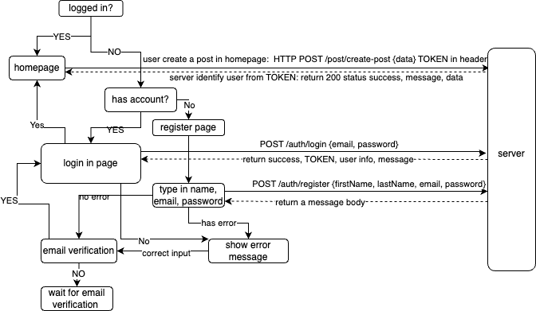

# Sociify
Sociify is a fully-featured social media web application, built with the MERN stack.  

Deployed at: https://sociify-gq2u.onrender.com

## Features

### User Authentication

- Quick registration with email verification.
- Seamless log-in for verified users.

### Social Networking

- Connect with friends by sending and receiving friend requests.
- Accept or deny friend requests as you like.
- Provide friend suggestion.
- Update personal profiles by adding personal information and profile pictures.
- Create and delete own posts with texts and images.
- Search post.
- Read posts in homepage.
- View profiles of users and browse through their own posts in their profile page.
- Interact with posts by liking and commenting and replying comments.

### User Experience 

- Dark Mode and Light Mode.
- Responsive UI Design.

## Technologies Used

### Client-Side Technologies
- Frontend Framework: React
- Styling: Tailwind CSS
- State Management: Redux Toolkit
- Form Handling: React Hook Form
- Icons: React Icons
- Routing: React Router DOM
- Image Uploads: Cloudinary
- API Calls: Axios
- Date and Time Formatting: Moment.js

###  Server-Side Technologies
#### Backend: Node.js, Express, MongoDB
#### Backend Key Packages: 
- bcryptjs (password hashing)
- body-parser (parsing incoming request bodies)
- cloudinary (image and video uploads)
- cors (enabling cross-origin requests)
- dotenv (loading environment variables)
- express (web framework)
- helmet (security middleware)
- jsonwebtoken (authentication)
- mongoose (MongoDB ODM)
- morgan (request logging middleware)
- nodemailer (email functionality)
- nodemon (development server)
- uuid (generating unique IDs)

## User Auth Flowchart

## Screenshots

## Future Updates
- resetpassword page
- Personal real-time Chat Feature
- Sort posts by attributes such as like count, comment count and date created
- ...
